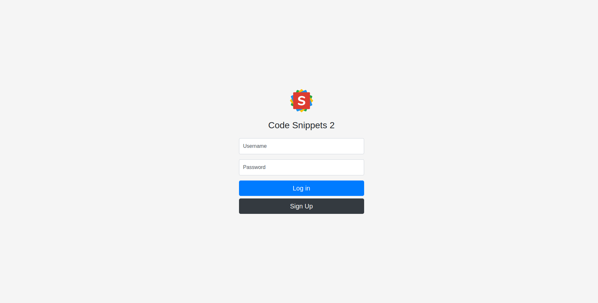
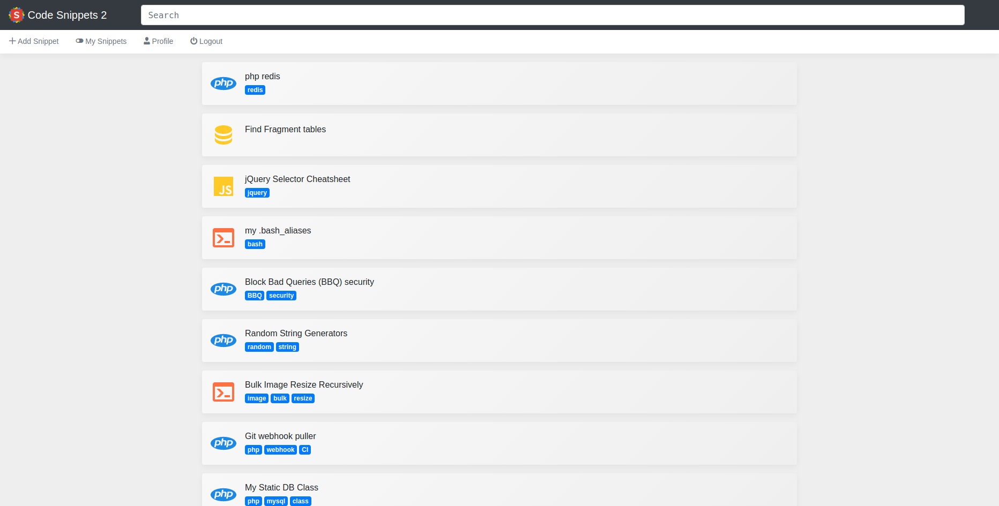
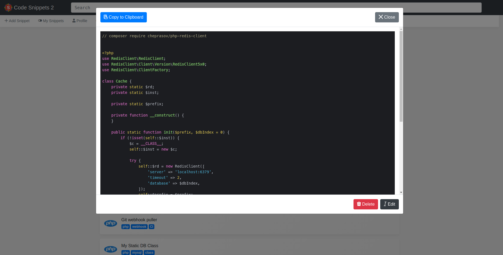
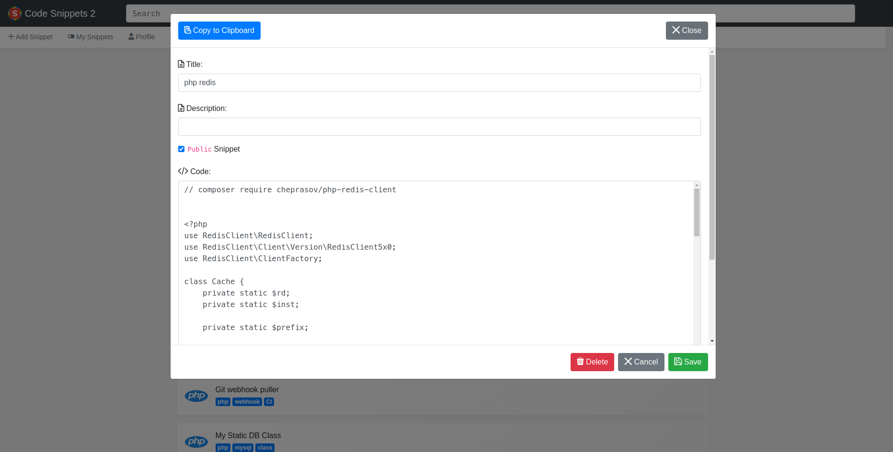

##Code Snipept2:
A simple code snippet.

Login:

---

Main View:

---

Code View:

---

Code Edit:

---

Public Code:

---

####TODOs:

~~1- Profile Modal for change `Password`~~

~~2- Register~~

3- Input Validation

~~4- Public Snippets~~

~~4.1- Show/Hide Public Snippets~~